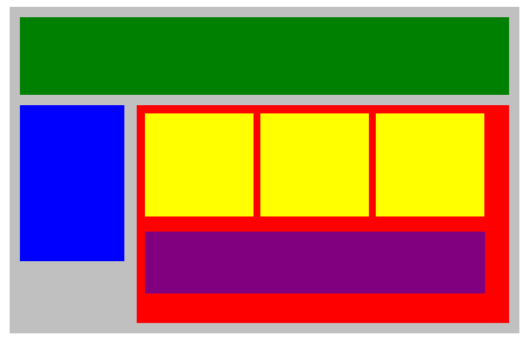
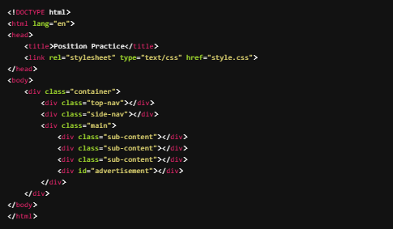
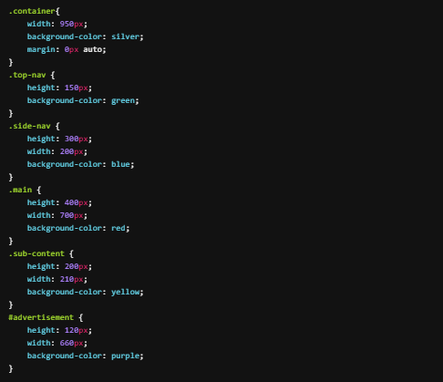
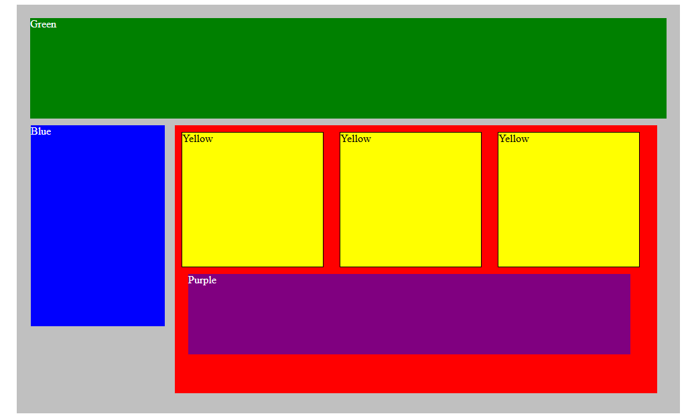

# Plotting Our Blocks

Try to duplicate the image below by adjusting the **CSS** code provided. Use ***margins*** and ***paddings*** to adjust the spaces between divisions and use the ***display*** property to be able to put each block in its proper place. We may need additional **CSS** properties.

Here's the HTML code:

And CSS:

While we do this assignment, we can make use `height` as well as the `vertical-align` property to give the necessary height to the division and also to vertically align some of the inline-blocks.

- [x] Copy the code above to set up the assignment

- [x] Apply CSS properties to recreate the image above

Here is how mine turned out below.

